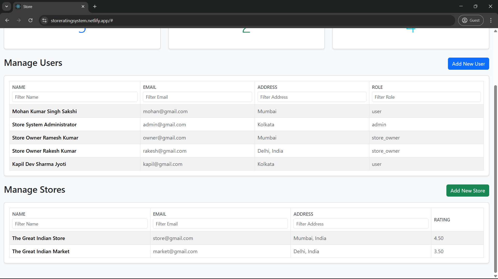
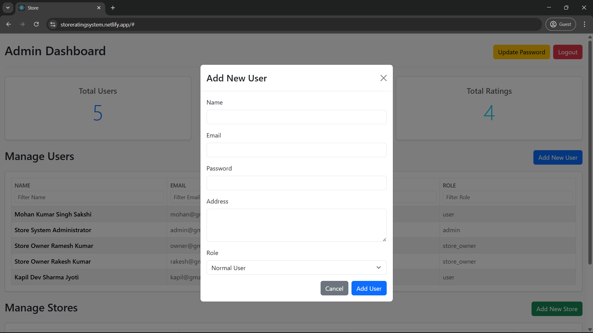
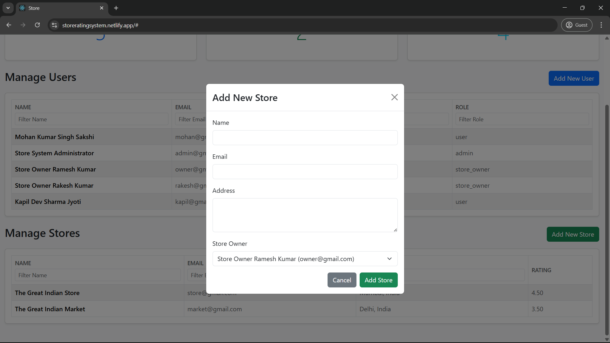
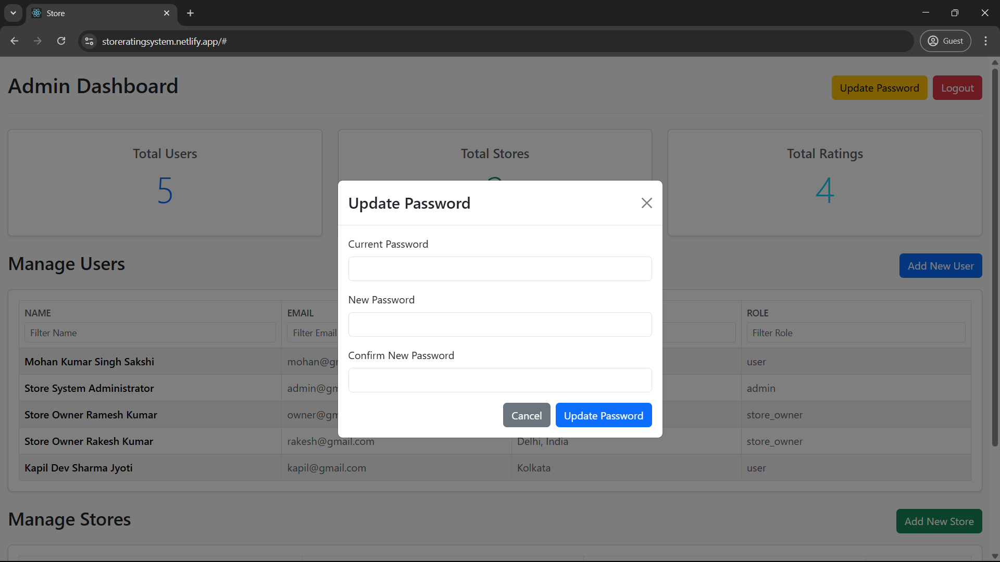
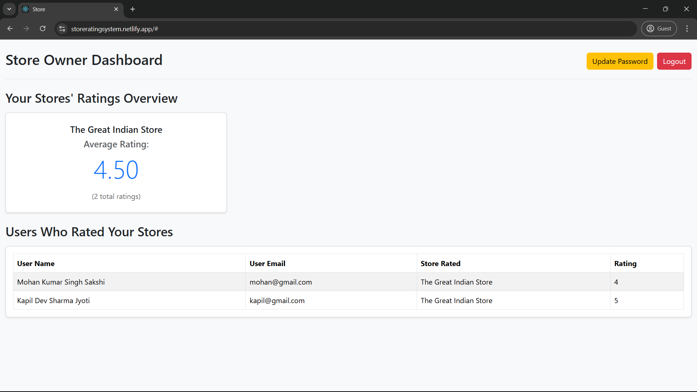
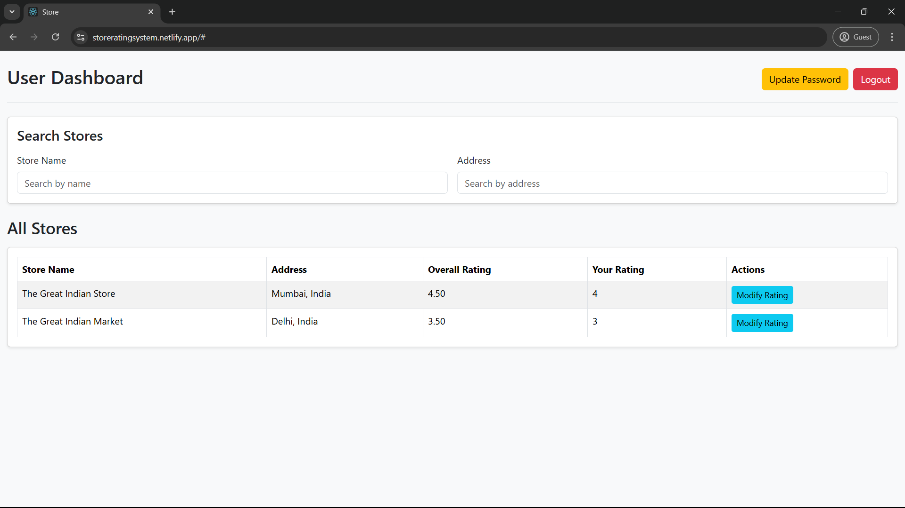
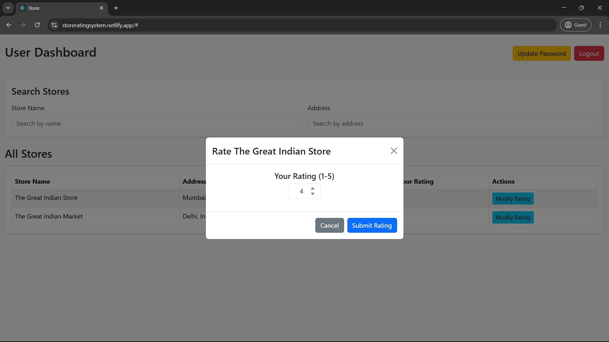

# 🏬 Store Rating System

This is a full-stack web application designed to manage stores, users, and allow users to submit and view ratings for stores. It features different dashboards for administrators, store owners, and regular users, each with tailored functionalities.

---

## 🌍 Live Demo

You can check out the live version of the application here:

👉 [Live Demo of Store Rating System](https://storeratingsystem.netlify.app)

---

## ✨ Features

### 🔐 Authentication & Authorization

* 👤 **User Registration**: New users can register for an account.
* 🔑 **User Login**: Authenticated users can log in to access their respective dashboards.
* 🛡️ **Role-Based Access Control**:

  * 👑 **Admin**: Full access to manage users and stores.
  * 🏪 **Store Owner**: Can view ratings for their owned stores and see who rated them.
  * 🙋‍♂️ **User**: Can browse stores, search, submit, and modify their ratings.
* 🔄 **Password Update**: All authenticated users can update their password.

---

### 🧑‍💼 Admin Dashboard

* 📊 View overall statistics (total users, total stores, total ratings).
* ➕ Add new users (roles: user, store_owner, admin).
* 🏬 Add new stores, assigning an existing user as the owner.
* 🧮 Manage users and stores through sortable and filterable tables.

---

### 🏪 Store Owner Dashboard

* ⭐ View average ratings for stores they own.
* 👥 See a list of users who have rated their stores.

---

### 👤 User Dashboard

* 🔍 Browse and search for stores by name and address.
* 📝 Submit new ratings for stores.
* ✏️ Modify existing ratings for stores.

---

### 📸 Screenshots

#### 🔐 Login Page


#### 🔐 Registration Page


#### 🧑‍💼 Admin Dashboard










#### 🏪 Store Owner Dashboard


#### 🙋‍♂️ User Dashboard




---

## 🛠️ Technologies Used

### Frontend

* ⚛️ **React.js** – A JavaScript library for building user interfaces.
* 💠 **React-Bootstrap** – Bootstrap components built with React.
* 🧱 **Bootstrap** – A popular CSS framework for responsive and mobile-first design.
* 🌐 **Environment Variable**: `process.env.REACT_APP_BACKEND_URL` – Backend API endpoint.

### Backend

* 🟢 **Node.js** – JavaScript runtime for server-side logic.
* 🚂 **Express.js** – Minimalist web framework for Node.js.
* 🗄️ **MySQL** – Relational database.
* 🔐 **JWT (JSON Web Tokens)** – Secure authentication and authorization.

---

## 🗂️ Project Structure

```
store_rating_system/
├── frontend/                 
│   ├── public/
│   ├── src/
│   │   ├── components/         # Reusable UI components (Modals, Tables)
│   │   ├── pages/              # Main application pages (Dashboards, Login, Register)
│   │   ├── services/           # API Integration
│   │   └── utils/validation.js # Client-side form validation
│   ├── App.js                  # Main React application component
│   ├── AuthContext.js          # React Context for authentication state
│   ├── .env                    # Environment variables
│   └── package.json
├── backend/                  
│   ├── controllers/            # Business logic for API endpoints
│   ├── middleware/             # Middlewares
│   ├── models/                 # Database interaction logic
│   ├── routes/                 # API route definitions
│   ├── .env                    # Environment variables
│   ├── index.js                # Main file
│   └── package.json
├── .gitignore                  # Git ignore rules
└── README.md                   # This file
```

---

## 🚀 Setup Instructions

### 1️⃣ Database Setup (MySQL/MariaDB)

📥 **Install MySQL/MariaDB**: Ensure your database server is running.

🗃️ **Create Database**:

```sql
CREATE DATABASE store_ratings_db;
```

🛠️ **Create Tables**:

```sql

USE store_ratings_db;

CREATE TABLE users (
  id INT AUTO_INCREMENT PRIMARY KEY,
  name VARCHAR(255) NOT NULL,
  email VARCHAR(255) NOT NULL UNIQUE,
  password VARCHAR(255) NOT NULL,
  address VARCHAR(400),
  role ENUM('user', 'store_owner', 'admin') DEFAULT 'user'
);

CREATE TABLE stores (
  id INT AUTO_INCREMENT PRIMARY KEY,
  name VARCHAR(255) NOT NULL,
  email VARCHAR(255) NOT NULL UNIQUE,
  address VARCHAR(400),
  owner_id INT,
  average_rating DECIMAL(3, 2) DEFAULT 0.00,
  FOREIGN KEY (owner_id) REFERENCES users(id) ON DELETE SET NULL
);

CREATE TABLE ratings (
  id INT AUTO_INCREMENT PRIMARY KEY,
  store_id INT NOT NULL,
  user_id INT NOT NULL,
  rating INT CHECK (rating >= 1 AND rating <= 5),
  created_at TIMESTAMP DEFAULT CURRENT_TIMESTAMP,
  UNIQUE (store_id, user_id),
  FOREIGN KEY (store_id) REFERENCES stores(id) ON DELETE CASCADE,
  FOREIGN KEY (user_id) REFERENCES users(id) ON DELETE CASCADE
);
```

---

### 2️⃣ Backend Setup

📂 Navigate to the backend:

```bash
cd backend
```

📦 Install dependencies:

```bash
npm install
```

📝 Create `.env`:

```env
DB_HOST=localhost
DB_USER=your_mysql_user
DB_PASSWORD=your_mysql_password
DB_DATABASE=store_ratings_db
PORT=5000
```

▶️ Start server:

```bash
node index.js
```

Backend runs at: [http://localhost:5000](http://localhost:5000)

---

### 3️⃣ Frontend Setup

📂 Navigate to the frontend:

```bash
cd frontend
```

📦 Install dependencies:

```bash
npm install
```

📝 Create `.env.development`:

```env
REACT_APP_BACKEND_URL=http://localhost:5000
```

▶️ Start React app:

```bash
npm run start
```

Frontend runs at: [http://localhost:3000](http://localhost:3000)

---

## 🔧 Usage

* 📝 **Register**: Sign up via the registration page.
* 🔐 **Login**: Access your dashboard after authentication.
* 🧭 **Explore Dashboards**:

  * 👑 Admin: Admin Dashboard.
  * 🏪 Store Owner: Owner Dashboard.
  * 🙋‍♂️ User: Browse and rate stores.

---

## 🤝 Contributing

Feel free to fork this repository, make improvements, and submit pull requests. Contributions are welcome! 🚀

---

## 📄 License

This project is open-source and available under the **MIT License**.
